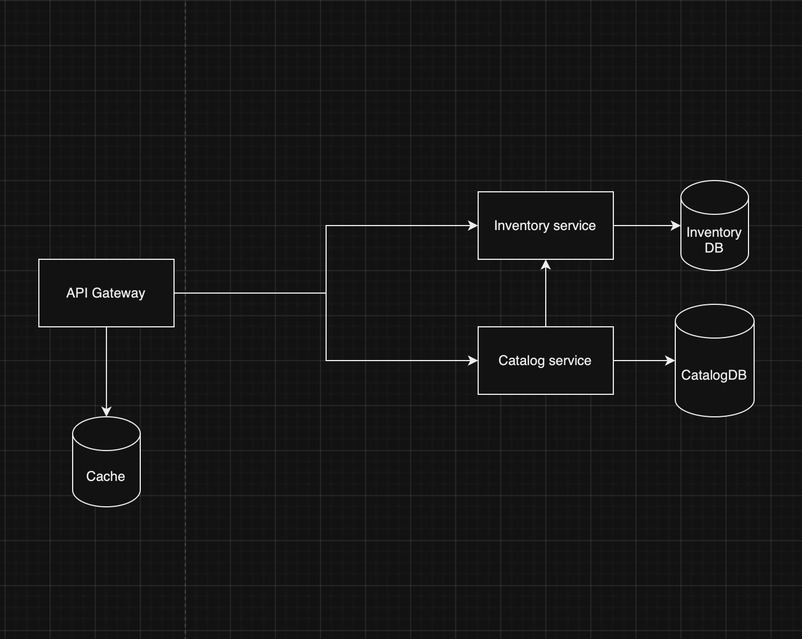

# PAD -- Project 2 Checkpoint 1

> **Performed by:** Ignat Vasile, group FAF-202

### Features I want to implement for this project

- Trip Circuit Breaker if multiple reroutes happen.
- Service High Availability.
- Implement Prometheus + Grafana for logging.
- Implement microservice-based 2 Phase Commits.
- Consistent Hashing for Cache.

### API Documentation

#### The endpoints can be accessed in any order. Just ensure that you create something before querying it because I didn't seed any data.

## <b><i>Catalog endpoints</i></b>

| Name        | Method | Description        |
| ----------- | ------ | ------------------ |
| catalog     | GET    | Get list of mangas |
| catalog/:id | GET    | Get manga by id    |
| catalog     | POST   | Create manga       |
| catalog/:id | DELETE | Delete manga by id |

 

## <b><i>Inventory endpoints</i></b>

| Name                      | Method | Description                  |
| ------------------------- | ------ | ---------------------------- |
| inventory/stocks/:mangaId | GET    | Get the stocks for a mangaId |
| inventory/stocks          | PUT    | Update stocks                |
| inventory/stocks          | POST   | Create stocks record         |
| inventory/locations       | GET    | Get list of locations        |
| inventory/locations       | POST   | Create location              |
| inventory/orders          | GET    | Get list of orders           |
| inventory/orders          | POST   | Create order                 |

 

### How to get it running

1. Clone this repository to your local machine.
2. Run the docker-compose up command.
3. Run migrations.
   - Navigate to MangaStore.Inventory directory.
   - Make sure you have EF Core CLI tools version 6.0.22: `dotnet tool install --global dotnet-ef`
   - Run the migrations: `dotnet ef database update --connection "Host=localhost:5432;Database=Inventory;Username=postgres;Password=Strongpassword1" --project .\src\MangaStore.Inventory.csproj`
4. Enjoy the application.

# PAD -- Project 1 Checkpoint 1

> **Performed by:** Ignat Vasile, group FAF-202

# E-commerce shop for mangas

### Assess Application Suitability (2pts)

##### Modularity and Scalability:

An e-commerce manga shop can leverage the microservices architecture by breaking down the application into multiple autonomous modules. In this lab project, I will focus on implementing just two microservices: the catalog service and the inventory service. This approach allows us to independently scale both microservices as needed.

##### Independent Development and Deployment:

As the microservices will handle separate functionalities, they can be developed independently of each other. This also holds true for deployment. For instance, if we wish to incorporate additional metadata into our manga listings or introduce a new filter to enhance the search functionality, we can make these updates without impacting the inventory service.

##### Technology Stack Flexibility:

Due to the inherent flexibility of microservices, they can employ diverse technologies under the hood. For instance, I've chosen to use a document database for the catalog service since there are no inherent relationships among the stored entities, and I prefer to avoid using an Object-Relational Mapping (ORM) tool. Conversely, for the inventory service, I've opted for a relational database because it involves many-to-many relationships, and I want to prevent the redundancy of storing multiple copies of the same data.

##### Enhanced Performance:

Given the independence of the microservices, we have the flexibility to optimize each one for enhanced performance in their respective areas of focus. For instance, I plan to implement metadata caching for the manga information retrieved from the catalog service.

### Define Service Boundaries (2pts)

I've decided to implement two microservices: the catalog service and the inventory service, each with specific functionalities. The catalog microservice will handle the retrieval and storage of manga metadata, while the inventory service will manage the availability checks of manga at a store.

### Choose Technology Stack and Communication Patterns (2pts)

I intend to create two RESTful APIs for my microservices, with the catalog and inventory services being developed in C#. Additionally, I'll build the gateway using Golang.

### Design Data Management (3pts)

Each service will have its dedicated database. The catalog service database will be responsible for storing manga metadata:

### Mangas:

- Id
- Title
- Author
- Description
- Category
- Price

The inventory service will be responsible for maintaining manga availability at specific locations, which will be organized into multiple tables:

### Locations:

- Id
- Name
- Address
- PhoneNumber

### Inventory:

- MangaId, LocationId (Composite key)
- Quantity
- RestockDate

### Orders:

- OrderId
- MangaId, LocationId (Foreign key)
- Quantity
- Name
- PhoneNumber
- Date

#### Catalog service

##### GET /mangas

###### Request example : /mangas?author=Joske10&category=Seinen

###### Response example : [{"id": 0, "title": "Naruto", "author": "Joske", "description": "A manga about Naruto", "category": "Seinen", "price": 10.99}]

#

##### GET /mangas/:id

###### Response example : {"id": 0, "title": "Naruto", "author": "Joske", "description": "A manga about Naruto", "category": "Seinen", "price": 10.99} || HTTP 404 Not Found

#

##### POST /mangas

###### Payload example: {"title": "Naruto", "author": "Joske", "description": "A manga about Naruto", "category": "Seinen", "price": 10.99}

###### Response example : {"id": 0, "title": "Naruto", "author": "Joske", "description": "A manga about Naruto", "category": "Seinen", "price": 10.99}

#

##### PUT /mangas/:id

###### Payload example : {"title": "Naruto", "author": "Joske", "description": "A manga about Naruto", "category": "Seinen", "price": 10.99}

###### Response example : {"id": 0, "title": "Naruto", "author": "Joske", "description": "A manga about Naruto", "category": "Seinen", "price": 10.99}

#

#### Inventory service

##### GET /inventory/:mangaId

###### Response example : {"mangaId": 0, "locationId": 0, "location": {...}, "quantity": 123, "restockDate": 12345765} || HTTP 400 Bad Request (Manga not found)

#

##### PUT /inventory

###### Payload example : {"mangaId": 0, "locationId": 0, "quantity": 123, "restockDate": 12345765}

###### Response example : {"mangaId": 0, "locationId": 0, "quantity": 123, "restockDate": 12345765}

##### GET /locations

###### Response example : [{"id": 0, "name": "MangaStore", "address": "Liberty street", "phone": "+1 234567 89"}]

#

##### POST /locations

###### Payload example : {"name": "MangaStore", "address": "Liberty street", "phone": "+1 234567 89"}

###### Response example : {"id": 0, "name": "MangaStore", "address": "Liberty street", "phone": "+1 234567 89"}

#

##### POST /order

###### Payload example : {"mangaId": 0, "locationId": 0, "quantity": 12, "name": "Gheorghe", "phone": "+1 23456 78"}

###### Response example : {"id": 0, "mangaId": 0, "locationId": 0, "quantity": 12, "name": "Gheorghe", "phone": "+1 23456 78"}

### Set Up Deployment and Scaling (1pt)

I will containerize the microservices using Docker in order to make sure they will work on every platform.
I will use docker-compose to deploy the microservice containers.
